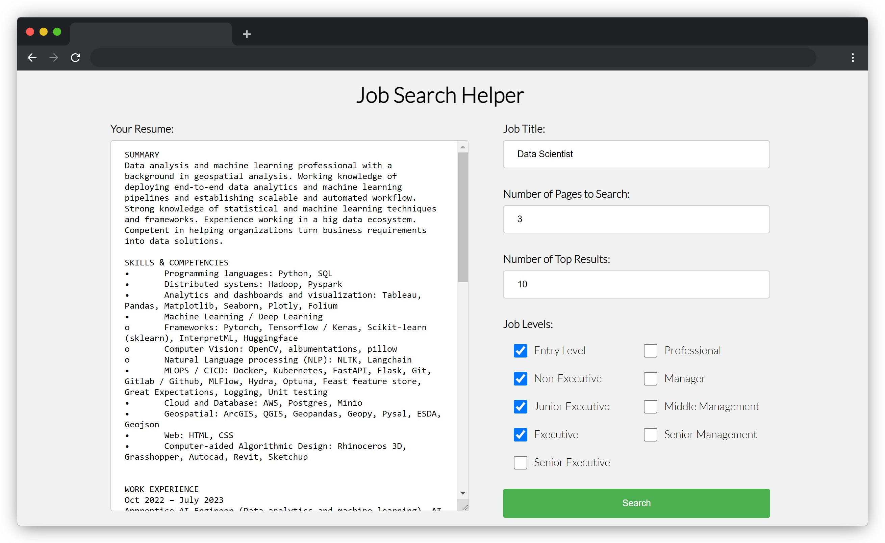
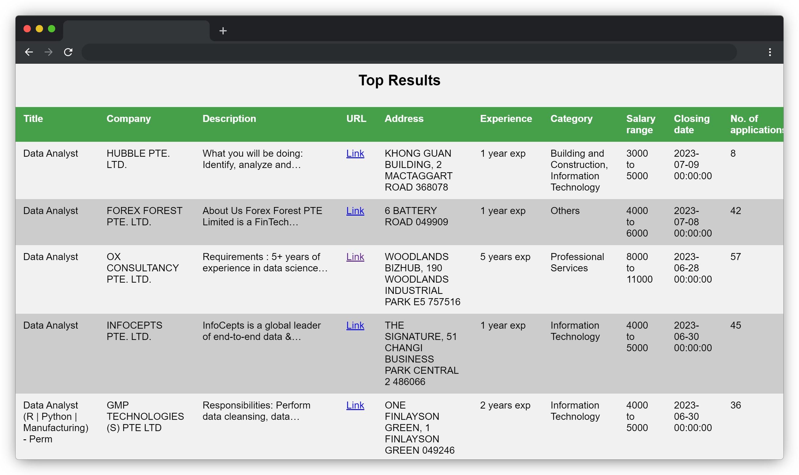

# Job Search Helper

## Description
Save time in your job search by having a helper to find relevant jobs based on your resume content. Perform vectorized similarity search across job descriptions and your resume to find the most relevant jobs.

<!-- Image with caption -->
<p align="center">
  
    <br>    
    <em>App Landing Page</em>
</p>

<p align="center">
  
    <br>    
    <em>Return Result Page</em>
</p>

## Usage

### Deploy App on local machine

1. Clone the repository
2. Build docker image
    ```bash
    docker build -t job_search_helper -f .\docker\api.dockerfile .
    ```
3. Run docker container
    ```bash
    docker run --name job_search_helper -e PORT=5001  -p 5001:5001 job_search_helper
    ```
4. Open browser and go to `http://localhost:5001/`

### Deploy App on AWS
1. Fork the repository
2. Set up AWS EC2 instance, make sure docker is installed and running
3. Add the secrets below to project repository settings
    - AWS_HOST: Public IP address of AWS EC2 instance
    - AWS_PRIVATE_KEY: Private key (from .pem file) to AWS EC2 instance
    - AWS_USERNAME: Username to AWS EC2 instance
    - DOCKER_USERNAME: Username to docker hub
    - DOCKER_PASSWORD: Password to docker hub
4. Any push to main branch will trigger the workflow to build and deploy the app to AWS EC2 instance, the workflow can also be triggered manually on GitHub
5. Open browser and go to `http://<AWS_HOST>:5001/`

